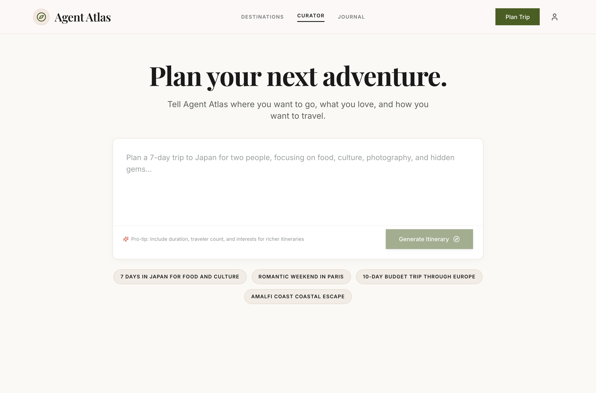
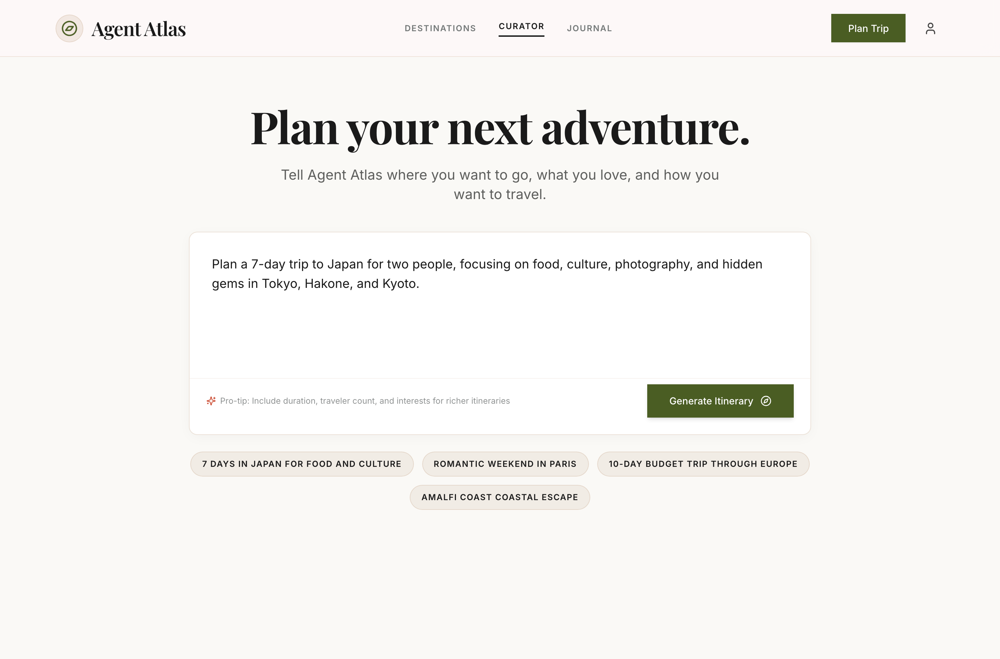
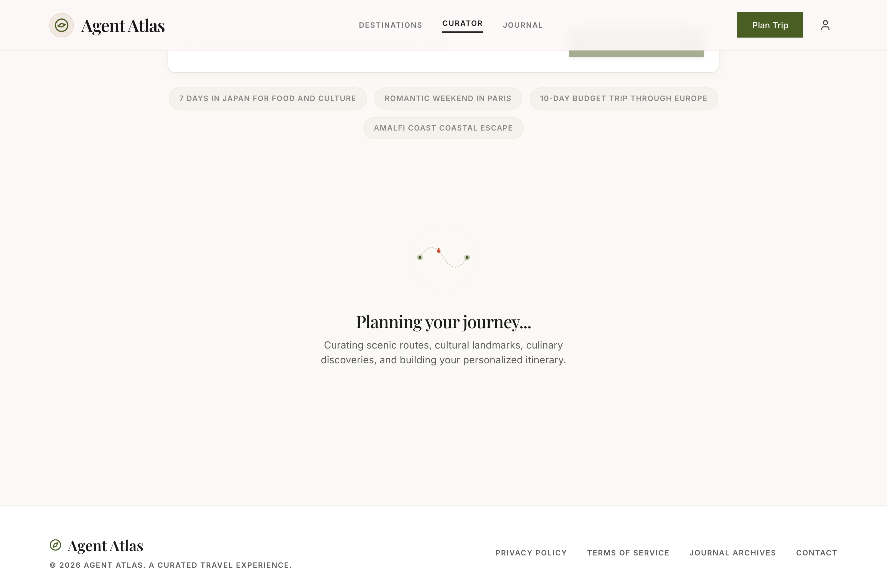
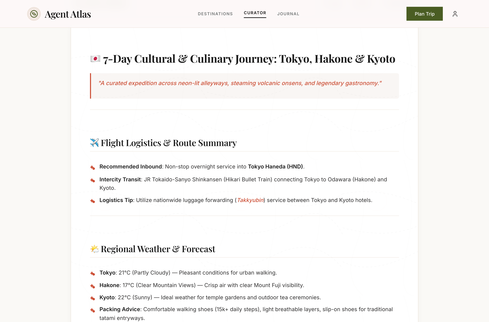
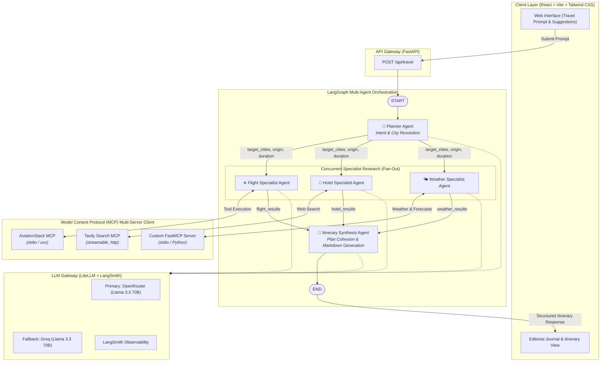

# 🧭 Agent Atlas

> **A resilient, full-stack multi-agent travel curation and itinerary engine powered by LangGraph, the Model Context Protocol (MCP), and LiteLLM.**

[](https://www.python.org/)
[](https://fastapi.tiangolo.com/)
[](https://langchain-ai.github.io/langgraph/)
[](https://modelcontextprotocol.io/)
[](https://litellm.ai/)
[](https://react.dev/)
[](https://www.typescriptlang.org/)
[](https://tailwindcss.com/)
[](https://vitejs.dev/)
[](apps/backend/tests)

---

## 📖 Overview

Traditional travel planning is fragmented: travelers must switch between flight aggregators, hotel search engines, weather forecast services, and regional travel blogs to piece together an itinerary. Generic single-prompt LLM travel planners often generate hallucinated schedules with unrealistic transit logistics and stale recommendations.

**Agent Atlas** solves this by orchestrating a **specialized multi-agent graph** that distributes travel research tasks across dedicated autonomous agents. Using the **Model Context Protocol (MCP)**, each agent interacts with real-time data sources (live flight databases, live web search, and current weather APIs) before a synthesis agent compiles a coherent, day-by-day travel journal.

### Why Agent Atlas?
- **Domain-Specific Multi-Agent Parallelism**: Instead of overloading a single model context, tasks are decomposed into entity resolution, flight routing, accommodation search, and weather forecasting.
- **Protocol-Driven Extensibility**: Built on the open **Model Context Protocol (MCP)** standard with heterogeneous transports (`stdio` subprocesses and `streamable_http`).
- **Resilient AI Gateway**: Production-grade LLM routing with automated multi-provider fallbacks (e.g., OpenRouter Llama 3.3 70B falling back to Groq Llama 3.3 70B), automatic retries, and LangSmith tracing.
- **Editorial Travel Journal UI**: A refined frontend inspired by classic travel journals, complete with typography tailored for reading, dynamic route loading animations, and instant print/PDF export.

---

## 📸 Interface & Workflow Demonstration

### 1. Travel Curator Landing Page
> *A warm, editorial interface designed with Playfair Display typography, curated exploration suggestion chips, and responsive prompt input.*



---

### 2. Interactive Prompt Curation
> *Users can enter custom natural language queries or select pre-curated cultural expeditions with automatic entity extraction.*



---

### 3. Dynamic Waypoint Route Loading State
> *Animated SVG flight and waypoint route visualization with live narrative feedback while specialist agents execute concurrently.*



---

### 4. Curated Travel Journal & Itinerary Output
> *Structured travel journal rendered on parchment canvas featuring day-by-day itineraries, flight logistics, localized weather forecasts, lodging tables, and one-click copy/print actions.*



---

## 🏛️ System Architecture

Agent Atlas employs a **Fan-Out / Fan-In** graph architecture using **LangGraph**. When a travel request arrives, the workflow extracts intent, executes specialized research agents in parallel, and merges findings into an actionable itinerary.



---

## ⚡ How It Works

### 1. Request Analysis & Entity Resolution (`Planner Agent`)
The user provides freeform text (e.g., *"Plan a 7-day trip to Japan for two focused on food and photography"*). The `planner_node` uses structured JSON prompting with temperature `0.0` to extract:
- `origin` (departure city, if provided)
- `country` / destination region
- `target_cities` (resolves general regions/countries to primary destination cities, e.g., `["Tokyo", "Kyoto"]`)
- `duration_days` (duration in days, defaulting to 5)

### 2. Parallel Specialist Execution (Fan-Out)
Once destination entities are resolved, LangGraph executes three agents concurrently:
- **Flight Agent (`flight_agent.py`)**: Connects to the **AviationStack MCP Server** via stdio subprocess (`uvx aviationstack-mcp`). Queries airlines, typical routes, estimated flight durations, and realistic pricing considerations for the resolved origin and destinations.
- **Hotel Agent (`hotel_agent.py`)**: Connects to **Tavily MCP** via `streamable_http`. Conducts real-time web search for top-rated accommodations, boutique stays, and neighborhood lodging advice for the target cities.
- **Weather Agent (`weather_agent.py`)**: Connects to a custom **FastMCP Weather Server** (`weather_mcp_server.py`) wrapping OpenWeather REST APIs. Fetches real-time temperatures, conditions, multi-day forecasts, and generates packing recommendations.

### 3. Synthesis & Itinerary Composition (Fan-In)
- **Itinerary Agent (`itinerary_agent.py`)**: Collects all accumulated outputs from `TravelState` (`flight_results`, `hotel_results`, `weather_results`, and `user_query`). It synthesizes them into an integrated markdown guide featuring:
  - Daily schedules with cultural, scenic, and culinary highlights
  - Lodging recommendations and neighborhood tips
  - Flight logistical summaries and transit considerations
  - Weather advisories and dynamic packing checklists

---

## 🛠️ Key Features & Engineering Highlights

### 1. Multi-Agent Coordination via LangGraph
- State-managed execution graph using `StateGraph(TravelState)` with `MemorySaver` checkpointer.
- Decoupled agent roles prevent single-prompt context pollution and allow each agent to have specialized system prompts, tools, and temperature profiles.

### 2. Model Context Protocol (MCP) Multi-Server Client
- Integrates `langchain-mcp-adapters` with a unified `MultiServerMCPClient` singleton managing distinct server transports:
  - **Tavily MCP**: `streamable_http` endpoint for live search.
  - **AviationStack MCP**: `stdio` transport running via `uvx --with "mcp<2.0.0" aviationstack-mcp`.
  - **Weather MCP**: Local `stdio` Python subprocess powered by `mcp.server.fastmcp.FastMCP`.
- In-memory tool caching (`_cached_tools`) and clean lifecycle shutdown in FastAPI lifespan hooks.

### 3. Resilient LLM Gateway with Multi-Provider Fallbacks
- Custom `ChatGateway` wrapping `ChatLiteLLM` from `langchain-litellm`.
- Seamless multi-provider support: OpenRouter, Groq, OpenAI, Anthropic, etc.
- Configurable retry policies (`max_retries`) and automated model fallbacks (`fallback_models`) to protect against rate limits and upstream outages.
- Built-in **LangSmith Tracing** integration via LiteLLM callback hooks for end-to-end distributed agent observability.

### 4. Editorial-Grade Web Experience
- **Typography & Theme**: Built with Playfair Display editorial serifs, Inter sans-serif, warm parchment backgrounds (`#FAF9F6`), terracotta accents (`#CC4F36`), and earthy green highlights (`#4A5D23`).
- **Interactive Prompts & Suggestions**: Curated exploration chips that pre-populate rich itineraries (Japan culinary adventure, Paris weekend, Central Europe, Amalfi Coast).
- **Animated Route Loading State**: Custom SVG route-path waypoint animation illustrating the travel journey while agents compute.
- **Rich Markdown Journal**: Full GFM rendering (`react-markdown` + `remark-gfm`), custom quote callouts, clipboard copying, and print-optimized stylesheets.

---

## 💻 Tech Stack

### Backend
- **Python 3.13+**
- **FastAPI 0.141+** — High-performance async REST API framework
- **LangGraph 1.2+** — Multi-agent state machine and workflow graph
- **LangChain 1.3+** — LLM prompt abstractions, agent bindings, and message handling
- **LiteLLM / langchain-litellm 1.96+** — Unified multi-provider LLM gateway with fallback routing
- **Model Context Protocol (MCP) 1.29+ & langchain-mcp-adapters** — Standardized tool execution
- **FastMCP & Requests** — Lightweight local MCP tool server wrapping OpenWeather API
- **Pydantic 2.13+** — Data validation and schema enforcement
- **Uvicorn** — ASGI production server
- **uv** — High-speed Python package and virtual environment manager

### Frontend
- **React 18.3** — Component-driven UI
- **TypeScript 5.7** — Strict static typing across all UI contracts
- **Vite 6.1** — Fast frontend build tooling and hot module reloading
- **Tailwind CSS 3.4** — Custom design tokens and responsive styling
- **Lucide React** — Minimalist vector iconography
- **React Markdown & Remark GFM** — Rich formatting for generated travel journals

### Testing & Observability
- **Pytest 9.1+ & Pytest-Asyncio** — Asynchronous test suite with comprehensive mock fixtures
- **LangSmith** — Tracing, latency monitoring, and token usage analytics

---

## 📂 Repository Structure

```text
agent-atlas/
├── .env.example                     # Environment configuration template
├── README.md                        # Project documentation & architecture
├── docs/
│   └── images/                      # High-resolution application screenshots
│       ├── 01-landing-curator.png   # Main landing screen
│       ├── 02-prompt-curation.png   # Interactive prompt view
│       ├── 03-loading-route.png     # Animated route loading indicator
│       └── 04-itinerary-journal.png # Curated travel journal view
└── apps/
    ├── backend/                     # FastAPI & Multi-Agent Backend
    │   ├── main.py                  # FastAPI application entrypoint & lifespan
    │   ├── pyproject.toml           # Python dependencies and uv configuration
    │   ├── tools.json               # MCP tool catalogue definition
    │   ├── agents/                  # Specialized LangGraph agent nodes
    │   │   ├── planner_agent.py     # Intent parsing & city resolution
    │   │   ├── flight_agent.py      # AviationStack flight specialist
    │   │   ├── hotel_agent.py       # Tavily hotel & accommodation specialist
    │   │   ├── weather_agent.py     # FastMCP weather & forecast specialist
    │   │   └── itinerary_agent.py   # Final itinerary synthesis agent
    │   ├── core/                    # Core infrastructural utilities
    │   │   ├── config.py            # Environment settings and key loader
    │   │   └── llm_gateway.py       # Resilient LiteLLM ChatGateway & fallbacks
    │   ├── schemas/                 # Pydantic and TypedDict state models
    │   │   ├── travel.py            # Request/Response API models
    │   │   └── travel_state.py      # LangGraph Shared TravelState schema
    │   ├── tools/                   # MCP Client and local FastMCP servers
    │   │   ├── mcp_client.py        # MultiServerMCPClient manager & tool filters
    │   │   └── weather_mcp_server.py# Local OpenWeather FastMCP server
    │   ├── workflows/               # Graph workflow orchestration
    │   │   └── travel_workflow.py   # LangGraph builder, fan-out/fan-in edges
    │   └── tests/                   # Automated Pytest suite (14 passing tests)
    │       ├── test_health.py       # FastAPI endpoint tests
    │       ├── test_llm_gateway.py  # LLM Gateway fallback & invocation tests
    │       ├── test_planner.py      # Entity extraction & city resolution tests
    │       └── test_mcp_tools.py    # MCP tool connectivity test script
    │
    └── web/                         # Vite + React + TypeScript Frontend
        ├── index.html               # Main HTML entrypoint with Google Fonts
        ├── package.json             # Frontend dependencies & scripts
        ├── tailwind.config.js       # Custom editorial color palette & typography
        ├── tsconfig.json            # TypeScript configuration
        ├── vite.config.ts           # Vite configuration
        └── src/
            ├── App.tsx              # Main layout and workflow state coordinator
            ├── index.css            # Custom CSS utilities & parchment textures
            ├── components/          # Reusable UI components
            │   ├── Header/          # Brand header and navigation
            │   ├── Footer/          # Editorial footer
            │   ├── TravelPrompt/    # Prompt textarea & suggestion chips
            │   ├── LoadingState/    # Animated SVG travel route indicator
            │   └── Itinerary/       # Markdown renderer, copy, and print actions
            ├── services/            # API client services
            │   ├── itinerary.ts     # Backend POST /api/travel integration
            │   └── mockData.ts      # Curated suggestion prompts
            └── types/               # TypeScript interfaces
                └── itinerary.ts     # Request, Response, and Status types
```

---

## 🚀 Getting Started

### Prerequisites
- **Python 3.13+** and [`uv`](https://docs.astral.sh/uv/) installed.
- **Node.js 18+** and `npm` installed.
- API keys for LLM and search services (OpenRouter/Groq, Tavily, AviationStack, OpenWeather).

---

### 1. Environment Configuration

Create a root `.env` file based on `.env.example`:

```bash
cp .env.example .env
```

Populate the configuration values:

```env
# Search & Tool APIs
TAVILY_API_KEY=your_tavily_api_key_here
AVIATIONSTACK_API_KEY=your_aviationstack_api_key_here
OPENWEATHER_API_KEY=your_openweather_api_key_here

# LLM Providers (OpenRouter, Groq, OpenAI)
OPENROUTER_API_KEY=your_openrouter_api_key_here
GROQ_API_KEY=your_groq_api_key_here
OPENAI_API_KEY=your_openai_api_key_here

# LLM Gateway Configuration
LLM_MODEL=openrouter/meta-llama/llama-3.3-70b-instruct
LLM_FALLBACK_MODEL=groq/llama-3.3-70b-versatile
LLM_RETRIES=2
LLM_TIMEOUT=60

# LangSmith Tracing & Observability (Optional)
LANGSMITH_API_KEY=your_langsmith_api_key_here
LANGSMITH_PROJECT=agent-atlas
LANGCHAIN_TRACING_V2=true
```

---

### 2. Backend Setup & Startup

The backend uses `uv` for dependency management.

```bash
# Navigate to backend directory
cd apps/backend

# Install dependencies into virtual environment
uv sync

# Run the FastAPI server
uv run uvicorn main:app --host 0.0.0.0 --port 8000 --reload
```

The backend API will be running at `http://localhost:8000`. You can inspect the interactive OpenAPI documentation at `http://localhost:8000/docs`.

---

### 3. Frontend Setup & Startup

```bash
# In a new terminal, navigate to the web directory
cd apps/web

# Install frontend dependencies
npm install

# Start the Vite development server
npm run dev
```

Open your browser and navigate to `http://localhost:5173`.

---

## 🧪 Testing

Agent Atlas includes a unit and integration test suite covering API endpoints, entity extraction, fallback mechanisms, message serialization, and LangGraph workflow orchestration.

### Running Backend Tests
Execute the test suite using `uv`:

```bash
cd apps/backend
uv run pytest
```

### Test Coverage Highlights:
- `test_health.py`: Verifies `/health` endpoint and mocked `/api/travel` workflow execution.
- `test_planner.py`: Tests structured JSON parameter extraction, multi-city resolution, and graceful fallback on malformed input.
- `test_llm_gateway.py`: Validates LiteLLM message conversion, sync/async completion helpers, tool bindings, fallback execution triggers, and LangSmith callback registration.

### Frontend Typecheck & Production Build
```bash
cd apps/web
npm run build
```

---

## 💡 Key Engineering Decisions & Trade-offs

| Decision | Implementation | Why It Matters | Trade-off / Alternative |
| :--- | :--- | :--- | :--- |
| **Multi-Agent Fan-Out vs. Monolithic ReAct Agent** | LangGraph `StateGraph` with explicit parallel edges from Planner to Flight, Hotel, and Weather nodes. | Drastically reduces total latency by parallelizing I/O-bound tool lookups (weather, flight schedules, web search). Prevents context window dilution. | Requires a fan-in synthesis step (`ItineraryAgent`) to reconcile potentially conflicting outputs. |
| **Model Context Protocol (MCP) Integration** | `MultiServerMCPClient` orchestrating stdio and HTTP transports. | Standardizes tool definitions across local scripts (`weather_mcp_server.py`) and remote servers (`Tavily`, `AviationStack`). Enables modular tool addition without modifying agent logic. | Adds process management overhead for stdio-based subprocesses (`uvx`). |
| **Unified LLM Gateway with Fallbacks** | Custom `ChatGateway` subclassing `ChatLiteLLM` with configured `fallback_models`. | Ensures system resilience: if the primary provider experiences rate limits or outages (e.g., OpenRouter), traffic automatically routes to an alternate provider (e.g., Groq) with zero downtime. | Requires consistent prompt compatibility across different open and closed-source model providers. |
| **In-Memory MCP Tool Caching** | Cached tool instances with clean teardown during FastAPI `lifespan`. | Prevents redundant MCP server discovery and handshakes on every single HTTP request. | Server restarts are needed if external MCP server schemas change dynamically. |
| **Editorial Journal UI Paradigm** | Custom parchment theme (`#FAF9F6`, Playfair Display serif, topographic overlay, print styles). | Elevates the product from a generic chatbot interface into a refined, publication-grade travel curator that users can directly export or print. | Requires custom CSS layers and markdown component overrides instead of off-the-shelf component libraries. |

---

## 🎯 Skills Demonstrated

- **Agentic AI Architecture**: Graph-based state machine orchestration with LangGraph, parallel agent coordination, and structured output parsing.
- **Protocol Engineering**: Multi-transport tool integration with the Model Context Protocol (MCP).
- **Resilient System Design**: AI gateway routing, automated model fallbacks, retry logic, and error boundaries.
- **Full-Stack Engineering**: FastAPI async REST backend paired with React 18, TypeScript, Vite, and Tailwind CSS.
- **Observability & QA**: Distributed LLM tracing with LangSmith, async unit testing with Pytest, and strict static typing.
